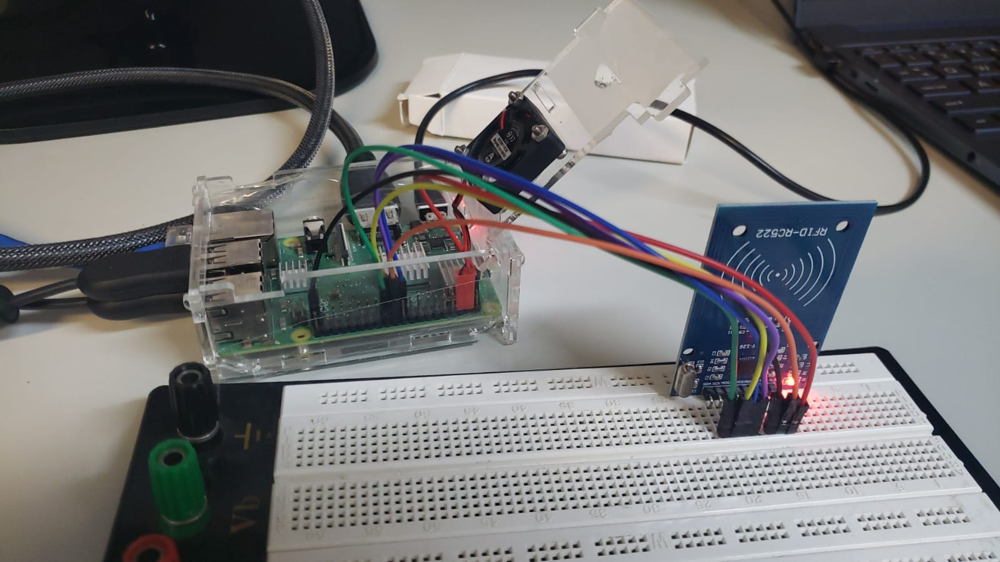

# Prática 5 - Projeto em Sistemas Embarcados

Esta prática consiste em 2 mini-projetos, com o primeiro deles sendo a integração da placa Raspberry Pi com um câmera para detecção de faces humanas, e o segundo sendo um sistema de tag RFID.

## Câmera + Raspberry Pi
Para a realização desta prática, foram utilizadas as bibliotecas OpenCV e PiCamera. O propósito do código é fazer com que a câmera reconheça as faces das pessoas e tire um foto destas, salvando as imagens com o seguinte título:

## Tag RFID + Raspberry Pi
Nesta prática, foi utilizado um módulo RFID MFC522 para realizar a leitura e gravação da tag. O propósito do código é de gravar um texto na memória da tag e depois realizar leituras do ID e do conteúdo da memória da tag para imprimir no terminal. A imagem abaixo mostra o circuito montado.

